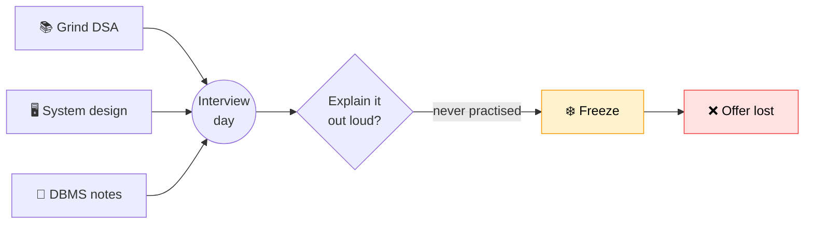
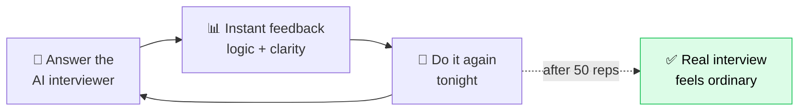
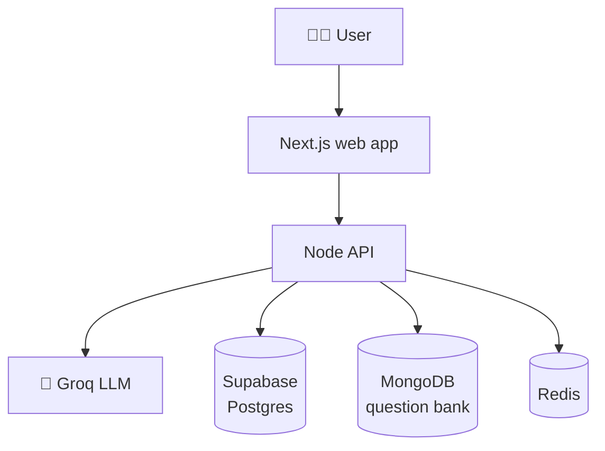

<p align="center">
  
</p>

<h3 align="center">Practice smarter, interview better.</h3>

<p align="center">
You don't fail interviews because you don't know enough.<br/>
You fail because you never practised the one thing that actually happens in the room — <b>talking</b>.
</p>

---

## 😰 The problem

You prepare for months. Then you sit down, your mind knows the answer… and you freeze, because you've never once said it out loud to another person.



> Everyone prepares **on paper**. Nobody practises the **interview itself** — explaining out loud, handling follow-ups, staying calm. The gap isn't knowledge. It's **reps**.

---

## 💡 The solution — Mockr

An AI that sits across from you like a real interviewer, every night, until the room stops being scary.



> By the time you sit in the real interview, you've already sat through fifty. It feels like something you've done a hundred times — because you have.

---

## 🚀 What you get

| 🎤 AI Mock Interviews | 🧑‍🏫 AI Tutor | 📚 Question Bank |
|:---|:---|:---|
| A real, talking interview. It asks, you explain out loud, it follows up like a human, then gives honest feedback on *what* you said **and** *how* you said it. | Stuck on a concept? It explains in plain language, at your pace, until it actually clicks — understood, not memorised. | Real interview questions across **SQL · System Design · DBMS · CS Fundamentals** — the topics that decide interviews, in one place. |

---

## 🛠️ How it's built



A Turborepo monorepo — `apps/web` (frontend) · `apps/api` (backend) · `packages/db`, `packages/shared`.

<details>
<summary><b>▶️ Run it locally</b></summary>

```bash
npm install
cp .env.example .env    # add your own keys
npm run dev:b2c         # → http://localhost:3000
```

`.env` files are gitignored — never commit real secrets. Set them in your host's dashboard for production (Vercel for `web`, Render/Railway for `api`).
</details>

---

<p align="center"><i>Built with AI for the OpenAI × NamasteDev Codex Hackathon.</i></p>
