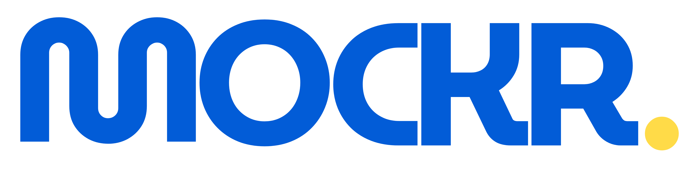
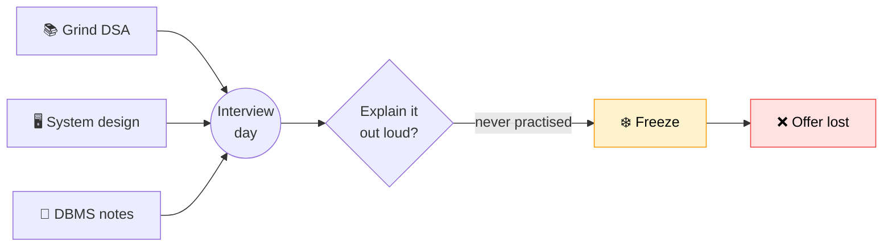
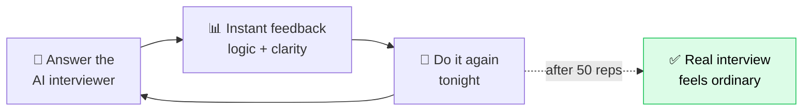
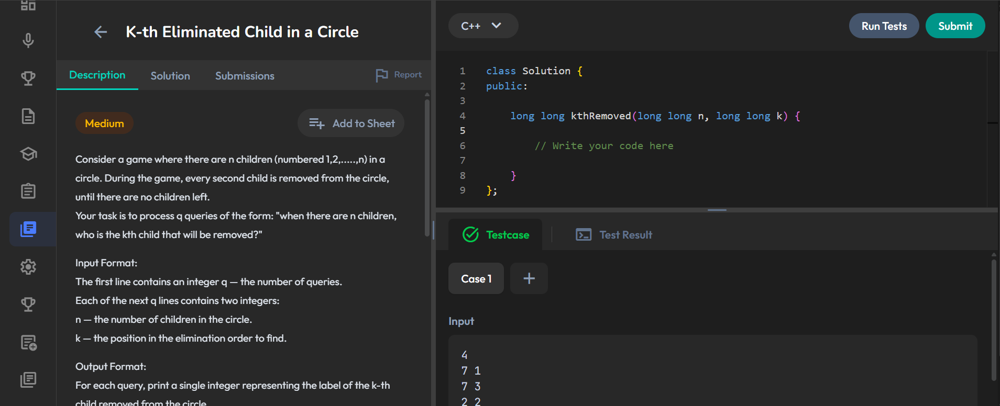
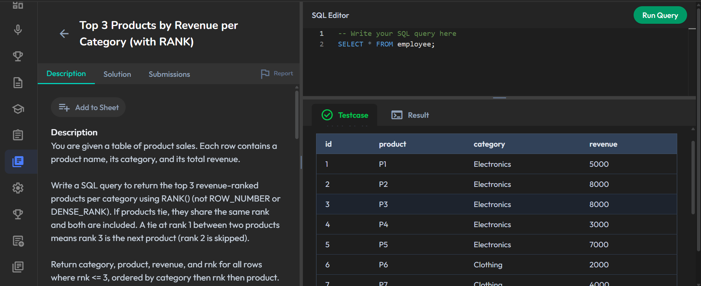
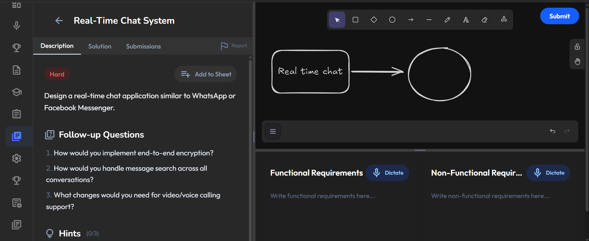
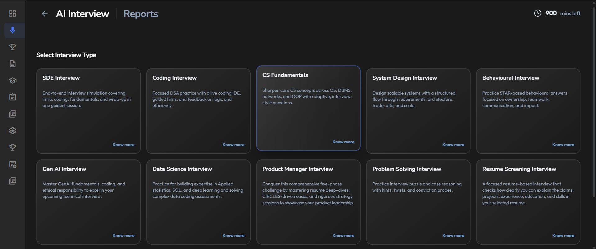
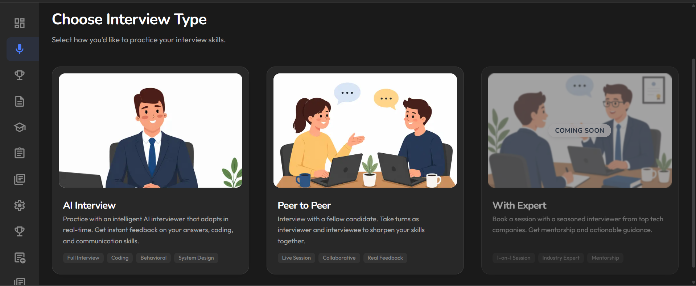

<p align="center">
  
</p>

<h3 align="center">Practice smarter, interview better.</h3>

<p align="center">
You don't fail interviews because you don't know enough.<br/>
You fail because you never practised the one thing that actually happens in the room — <b>talking</b>.
</p>

---

## 😰 The problem

You prepare for months. Then you sit down, your mind knows the answer… and you freeze, because you've never once said it out loud to another person.



> The gap isn't knowledge. It's **reps** — real interview reps most students never get until it already counts.

---

## 💡 The solution — Mockr

An AI that sits across from you like a real interviewer, every night, until the room stops being scary.



---

## 🤔 "Can't I just ask ChatGPT to interview me?"

It'll ask you questions. But a real interview isn't just talk — you **code in an editor**, **query a live database**, and **draw the system on a board**. Mockr gives you the whole room.

| Live Coding IDE | SQL Editor | System Design Canvas |
|:---:|:---:|:---:|
|  |  |  |
| Real editor with hidden test cases — **run & submit**, just like the real thing. | Write real queries against real tables and see the **result set**. | Actually **draw** the architecture — boxes, arrows, requirements. |

<br/>

| One AI · Every Interview Type | Three Ways to Practise |
|:---:|:---:|
|  |  |
| SDE, Coding, **System Design**, CS Fundamentals, Behavioural, PM, Data Science… | AI interviewer, live **peer-to-peer**, or an industry expert. |

---

## 🚀 What you get

| 🎤 AI Mock Interviews | 🧑‍🏫 AI Tutor | 📚 Question Bank |
|:---|:---|:---|
| A real, talking interview with follow-ups and honest feedback on *what* you said **and** *how* you said it. | Stuck on a concept? It explains in plain language until it actually clicks. | Real questions across **SQL · System Design · DBMS · CS Fundamentals · DSA**. |

---

<details>
<summary><b>🛠️ How it's built · run it locally</b></summary>

<br/>

A Turborepo monorepo — `apps/web` (Next.js frontend) · `apps/api` (Node backend) · `packages/db`, `packages/shared`. Powered by Supabase (Postgres), MongoDB (question bank), Redis, and Groq (LLM).

```bash
npm install
cp .env.example .env    # add your own keys
npm run dev:b2c         # → http://localhost:3000
```

`.env` files are gitignored — never commit real secrets. Set them in your host's dashboard for production (Vercel for `web`, Render/Railway for `api`).
</details>

---

<p align="center"><i>Built with AI for the OpenAI × NamasteDev Codex Hackathon.</i></p>
