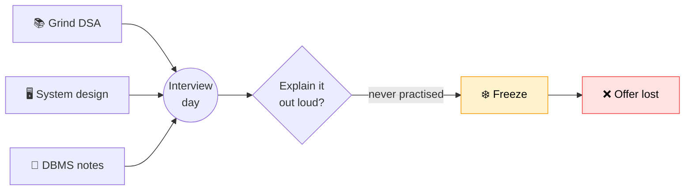
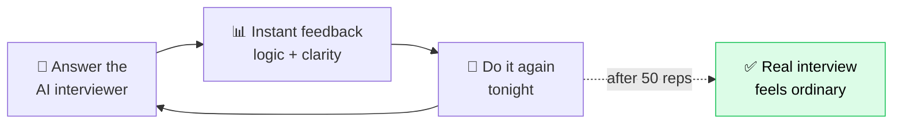
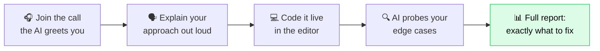
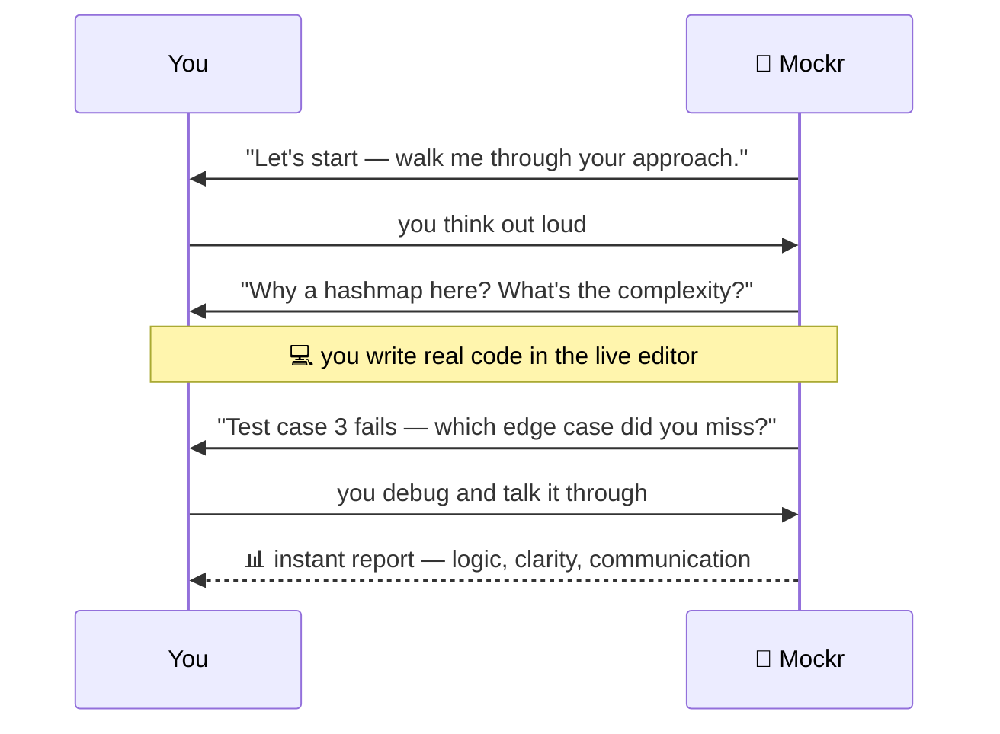
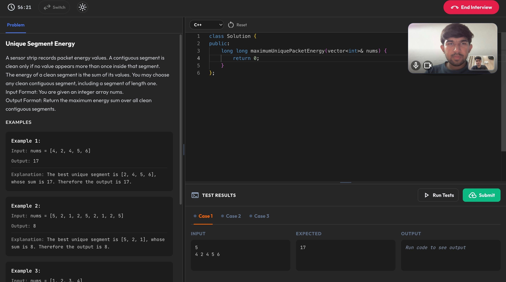
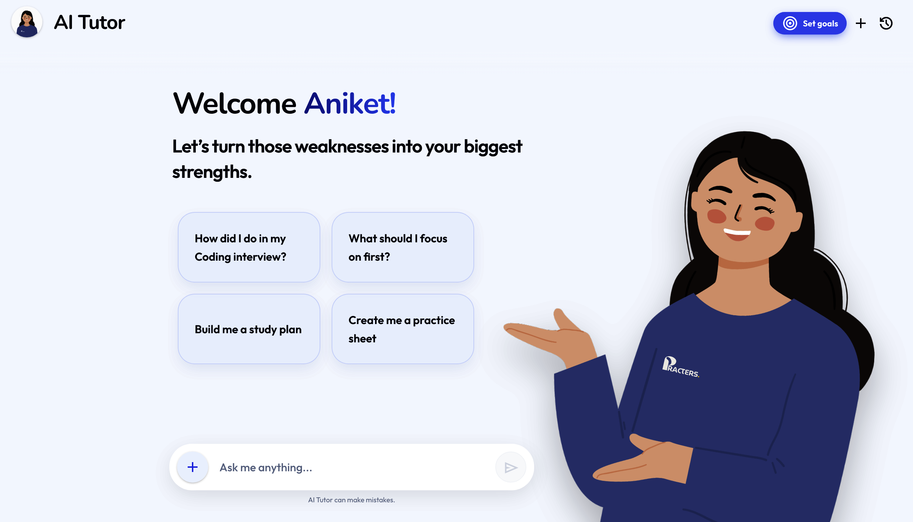
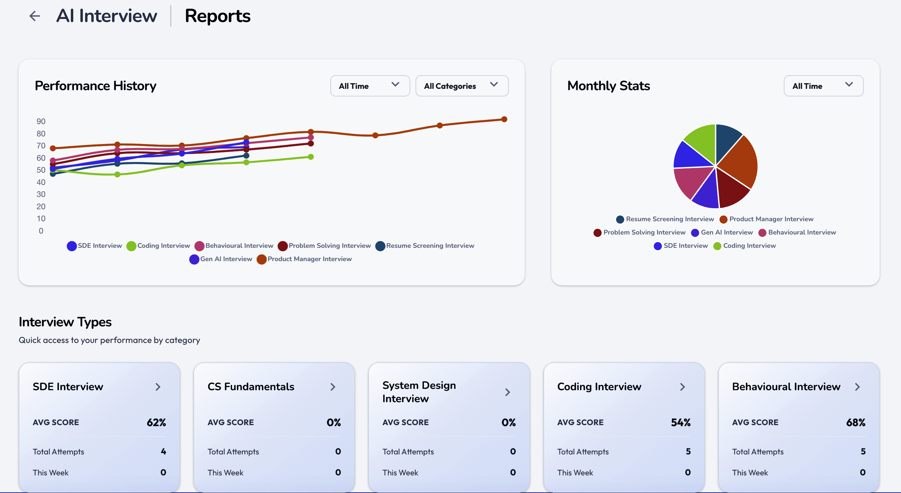

<p align="center">
  
</p>

<h3 align="center">Practice smarter, interview better.</h3>

<p align="center">
You don't fail interviews because you don't know enough.<br/>
You fail because you never practised the one thing that actually happens in the room — <b>talking</b>.
</p>

---

## 😰 The problem

You prepare for months. Then you sit down, your mind knows the answer… and you freeze, because you've never once said it out loud to another person.



> The gap isn't knowledge. It's **reps** — real interview reps most students never get until it already counts.

---

## 💡 The solution — Mockr

An AI that sits across from you like a real interviewer, every night, until the room stops being scary.



---

## 🤔 "Can't I just ask ChatGPT to interview me?"

Sure — and it'll lob you softballs and call every answer "great." That isn't an interview.

A real one has an **editor that runs your code against hidden test cases**, a **live SQL console**, a **whiteboard you actually draw on**, a clock, a camera — and an interviewer who **interrupts, digs, and won't let you hand-wave**. ChatGPT can't watch you code, can't pressure-test your silence, and can't tell you whether you're *actually* getting better week over week.

Mockr can — because it isn't a chat box, it's the whole room. *(Scroll down and see. 👇)*

---

## 🚀 What you get

**🎤 AI Mock Interviews** — a real, talking interview with follow-ups and honest feedback on *what* you said **and** *how* you said it.

**🧑‍🏫 AI Tutor** — stuck on a concept? It explains in plain language until it actually clicks.

**📚 Question Bank** — real questions across **SQL · System Design · DBMS · CS Fundamentals · DSA**.

---

## 🎬 What one session actually feels like

> Not a quiz you click through. A conversation that pushes back.



It listens to your words, reacts to your code, and digs in exactly where a real interviewer would:



It interrupts. It follows up. It notices when you go quiet — the same pressure as the real room, without the cost of failing. **Ninety seconds in, you forget it's an AI.**



<p align="center"><b>👉 Do one interview tonight. That's all it takes to feel the difference.</b></p>

---

## 🖼️ A look inside Mockr

**Pick how you want to practise** — AI interviewer, live peer-to-peer, or an expert.


**💻 Code it · 🗄️ query it · 🎨 design it — for real.**

<p align="center">
  
  
  
</p>

**Learn from it, and watch yourself improve.**

<p align="center">
  
  
</p>

---

<details>
<summary><b>🛠️ How it's built · run it locally</b></summary>

<br/>

A Turborepo monorepo — `apps/web` (Next.js frontend) · `apps/api` (Node backend) · `packages/db`, `packages/shared`. Powered by Supabase (Postgres), MongoDB (question bank), Redis, and Groq (LLM).

```bash
npm install
cp .env.example .env    # add your own keys
npm run dev:b2c         # → http://localhost:3000
```

`.env` files are gitignored — never commit real secrets. Set them in your host's dashboard for production (Vercel for `web`, Render/Railway for `api`).
</details>

---

<p align="center"><i>Built with AI for the OpenAI × NamasteDev Codex Hackathon.</i></p>
