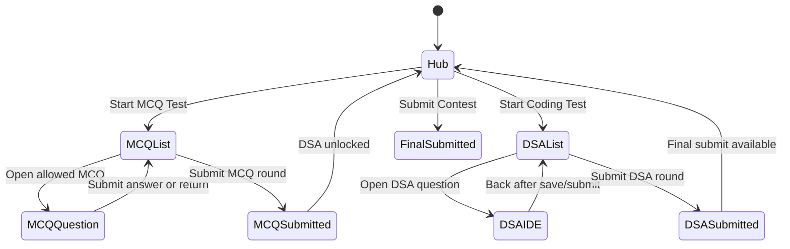

# Contest MCQ + DSA Phased V2 Architecture

This document scopes the MCQ system to the existing `apps/contest-service` contest product. It does not reuse the old secure OA design. The goal is to keep the current DSA contest flow intact while adding a company-OA style MCQ phase before coding.

## Goals

- Contest coordinators can create MCQ questions in the contest question bank.
- MCQ question content is stored in MongoDB collection `contest_mcq_questions`.
- Contests can be configured as `dsa_only` or `mcq_then_dsa`.
- The candidate first sees `/contests/:id` as a round hub with MCQ Test and DSA Coding Test.
- In `mcq_then_dsa`, DSA is locked until the MCQ round is submitted.
- MCQ pages never show correctness or score during the MCQ phase.
- MCQ scoring has no negative marking: correct gets points, incorrect and unanswered get 0.
- Coordinator can choose whether the hub may show score. `/contests/:id/mcq` and MCQ question pages never show score.
- Coordinator can enable MCQ sequencing. If sequencing is on, the candidate must submit the current MCQ before the next MCQ unlocks, and cannot go back to a submitted MCQ.
- DSA solving keeps the current Judge0, submission, scoring, leaderboard, and IDE behavior.
- The final submitted page can show MCQ solution/explanation only after the contest is submitted or the contest has ended, depending product policy.

## Current Contest Anchors

Current DSA flow:

- Admin creates DSA contest questions from `apps/web/src/app/(authenticated)/(sidebar)/admin/contest-questions/new/page.tsx`.
- Admin API writes full DSA question data into Mongo collection `contest_questions` through `POST /admin/contest-questions/dsa`.
- Contest creation and manage APIs store only contest selection rows in Postgres table `contest_questions`.
- `contest_questions.question_id` references a Mongo question by `_id`, `problemId`, or `frontendId`.
- Runtime question hydration reads Postgres selection rows, hydrates from Mongo, and caches Redis key `contest:${contestId}:questions:ide-v8`.
- Current DSA candidate route is `/contests/:id` for listing and `/contests/:id/solve/:questionId` for the strict IDE.
- DSA submissions go through `/execute/submit`, Bull, Judge0, `contest_submissions`, and `finalizeSubmissionScore`.
- Participant total score lives on `contest_participants.total_score`.
- Final submit is `POST /contests/:id/submit`.

V2 keeps those anchors, but adds round state around them.

## Data Ownership

Postgres owns:

- Which contest uses which question.
- Which phase a selected question belongs to.
- Candidate round progress.
- Candidate MCQ answers and released MCQ score.
- Final participant submission state.
- Optional integrity event audit log.

MongoDB owns:

- Full DSA question body in `contest_questions`, unchanged.
- Full MCQ question body in `contest_mcq_questions`.
- Contest usage flags for bank filtering.

Redis owns:

- Derived hydrated runtime question lists.
- Live leaderboard cache, unchanged for DSA and final totals.

## MongoDB Collection: `contest_mcq_questions`

Use a dedicated collection. Do not store MCQs inside the DSA `contest_questions` collection.

Recommended document shape:

```ts
{
  _id: ObjectId,
  problemId: "mcq-000001",
  frontendId: "mcq-000001",
  problemSlug: "rlhf-overfitting-reward-model-generalization",
  title: "RLHF reward model overfitting",
  questionText: "An RLHF pipeline's reward model exhibits...",
  difficulty: "Easy" | "Medium" | "Hard",
  topics: ["LLM", "RLHF"],
  companyTags: ["Generic OA"],
  options: [
    { id: "A", text: "Reduce the depth...", order: 0 },
    { id: "B", text: "Lower the learning rate...", order: 1 },
    { id: "C", text: "Increase the diversity...", order: 2 },
    { id: "D", text: "Implement stronger L2...", order: 3 }
  ],
  correctOptionId: "C",
  explanation: "More diverse preference data reduces overfitting...",
  points: 1,
  createdBy: "user_id",
  usedInContests: [],
  isUsedInContest: false,
  currentlyChoosedForContest: false,
  createdAt: Date,
  updatedAt: Date
}
```

Rules:

- V2 supports single-answer MCQ only.
- `problemId` and `frontendId` should be prefixed with `mcq-` to avoid collision with existing DSA numeric identifiers while the old `(contest_id, question_id)` unique constraint still exists.
- Candidate payloads must never include `correctOptionId` or `explanation` before solution release.
- Admin preview payload can include `correctOptionId` and `explanation`.
- Rendered markdown must be sanitized before display.

Recommended Mongo indexes:

```js
db.contest_mcq_questions.createIndex({ problemSlug: 1 }, { unique: true })
db.contest_mcq_questions.createIndex({ problemId: 1 }, { unique: true })
db.contest_mcq_questions.createIndex({ frontendId: 1 }, { unique: true })
db.contest_mcq_questions.createIndex({ currentlyChoosedForContest: 1 })
db.contest_mcq_questions.createIndex({ isUsedInContest: 1 })
db.contest_mcq_questions.createIndex({ usedInContests: 1 })
db.contest_mcq_questions.createIndex({ difficulty: 1, topics: 1 })
```

## Postgres Additions

Additive SQL only, no Prisma migration required for the first rollout.

`contests`:

- `round_flow`: `dsa_only | mcq_then_dsa`.
- `show_score_on_hub`: coordinator-controlled score visibility on `/contests/:id`.
- `mcq_sequential`: when true, MCQ questions are one-way and one-at-a-time.

`contest_questions`:

- `question_type`: `dsa | mcq`.
- `phase`: `dsa | mcq`.
- `phase_order`: ordering inside the phase.

`contest_round_attempts`:

- One row per participant per phase.
- Tracks `not_started | in_progress | submitted | auto_submitted`.
- Unlocks DSA after MCQ is submitted.
- Stores released phase score.

`contest_mcq_answers`:

- One row per participant and MCQ question.
- Stores selected option and lock/evaluation state.
- `is_correct` and `points_awarded` are server-only and never returned during MCQ.

`contest_integrity_events`:

- Optional but recommended server audit log for tab switch, fullscreen exit, clipboard, blocked shortcut, and page-leave events.
- Current client-side warning count can remain, but V2 should also persist events server-side.

## Coordinator UX

Contest question bank:

- Add tabs or segmented control: DSA Questions, MCQ Questions.
- Add `/admin/contest-questions/new?type=mcq` or a dedicated `/admin/contest-questions/mcq/new`.
- MCQ form fields:
  - title
  - question text
  - difficulty
  - topics/company tags
  - options, minimum 2 and maximum 6
  - correct option
  - explanation/solution
  - default points
- Preview uses the same preview pattern as DSA, but right panel shows options instead of the code editor.

Contest manage page:

- Add contest mode: `DSA only` or `MCQ then DSA`.
- Add `Show score on contest hub` toggle.
- Add `Sequential MCQ` toggle.
- Selection UI should keep two sections:
  - MCQ phase questions
  - DSA phase questions
- Each selected question sends:

```json
{
  "questionId": "mcq-000001",
  "questionType": "mcq",
  "phase": "mcq",
  "points": 1,
  "order": 0
}
```

DSA rows still send `negativePoints` and `negativeCap`. MCQ rows must force both to 0.

## Candidate Routes

### `/contests/:id`

This becomes the contest hub.

Before contest starts:

- Same registration/timer behavior as today.

During active `dsa_only` contest:

- Existing DSA question list can remain, or it can render as one DSA Coding Test card that opens `/contests/:id/dsa`.

During active `mcq_then_dsa` contest:

- Show two round cards:
  - MCQ Test
  - DSA Coding Test
- MCQ is unlocked first.
- DSA is locked until the MCQ round is submitted.
- Show score only if `show_score_on_hub = true`.
- Never show per-MCQ correctness on this page.
- Final Submit appears after DSA round is submitted, or when the contest has no DSA questions.

### `/contests/:id/mcq`

This is the MCQ round lobby/list.

- Same visual language as the contest hub.
- No score display, always.
- Shows MCQ questions with status:
  - not reached
  - available
  - submitted
- This page is not the strict proctored screen by itself.
- If `mcq_sequential = false`, all unsubmitted MCQs are open until round submit.
- If `mcq_sequential = true`, only the next allowed MCQ is open.

### `/contests/:id/mcq/:questionId`

This is the strict MCQ attempt page.

- Proctoring starts here.
- Use the screenshot layout as reference:
  - left pane: question number, text, marks
  - right pane: answer options
  - top or sticky shell: timer, warnings, submit
  - watermark/background identity pattern if already used in contests
- No correctness.
- No score.
- No explanation.
- No solution.
- If the candidate leaves, tabs away, exits fullscreen, uses blocked shortcuts, or hits warning limit, use the same contest integrity rules as the DSA IDE.

Submit behavior:

- `mcq_sequential = true`: Submit Answer locks that question, evaluates server-side, and unlocks the next MCQ. The candidate cannot reopen previous submitted MCQs.
- `mcq_sequential = false`: Save Answer can update a draft. Submit MCQ Round locks all answers and evaluates the phase.

### `/contests/:id/dsa`

This is the DSA round lobby/list.

- It can reuse most of the current `/contests/:id` question-list UI.
- It is locked until MCQ round status is `submitted` or `auto_submitted`.
- It can show DSA status and score based on `show_score_on_hub`.
- Clicking a question enters the current strict DSA IDE at `/contests/:id/solve/:questionId`.

### `/contests/:id/solve/:questionId`

Keep current DSA IDE behavior.

- Judge0 execution stays unchanged.
- Existing proctoring stays here.
- Existing score update path stays here.

### `/contests/:id/submitted`

After final submit:

- Shows final score if allowed.
- Shows MCQ answer review and explanations only after the solution-release condition is satisfied.
- For ended contests, solution review can show:
  - question text
  - selected option
  - correct option
  - explanation
  - points awarded

## Round State Machine

For `mcq_then_dsa`:



Server rules:

- MCQ round can start only when contest is active and participant is registered.
- DSA round can start only when MCQ round is submitted, unless `round_flow = dsa_only`.
- Final contest submit auto-submits any in-progress round first.
- When contest timer ends, server submits the current round and final contest with `submissionType = auto_time`.
- Once `contest_participants.is_submitted = true`, no round or answer mutation is allowed.

## MCQ Sequencing

Coordinator setting: `contests.mcq_sequential`.

If disabled:

- Candidate can open any MCQ.
- Candidate can change answers until MCQ round submit.
- MCQ score is evaluated on round submit.

If enabled:

- Server computes `nextAllowedOrder` from submitted MCQ answers.
- Candidate can open only the MCQ with `phase_order = nextAllowedOrder`.
- Candidate cannot open a future MCQ.
- Candidate cannot reopen a previously submitted MCQ.
- Submit Answer locks the row in `contest_mcq_answers`.
- After submit, the response includes only next question metadata, not correctness or score.
- Last MCQ submit can automatically submit the MCQ round or show a final MCQ round submit screen.

Recommended server rejection:

- Previous submitted MCQ: `423 Locked`.
- Future MCQ before current is submitted: `409 Conflict`.
- DSA before MCQ submitted: `403 Forbidden`.

## Scoring

MCQ scoring:

```text
selectedOptionId == correctOptionId -> +points
selectedOptionId != correctOptionId -> 0
unanswered -> 0
```

No negative marking, no negative cap.

DSA scoring:

- Keep current scoring behavior.
- Keep negative points/cap for coding questions if configured.
- Keep Judge0 and `contest_submissions`.

Total score:

- `contest_participants.total_score` remains the single final score field.
- MCQ score is added once when the MCQ round is submitted.
- DSA score continues to update through current `finalizeSubmissionScore`.
- Final submit still clamps negative final totals to zero.

Leakage policy:

- `/contests/:id/mcq` and `/contests/:id/mcq/:questionId` always hide score.
- `/contests/:id` shows or hides total score using `show_score_on_hub`.
- If `show_score_on_hub = true`, the candidate can infer aggregate MCQ performance after MCQ submit, but not which MCQs were correct.
- If `show_score_on_hub = false`, the hub should render `Score hidden until final submission` or no score block.

## Backend API Contracts

All routes require auth middleware before handlers. All request bodies and params must use Zod validation. User ID must come from the verified session, never from request body.

Admin MCQ question bank:

```http
GET  /admin/contest-questions/mcq/next-id
POST /admin/contest-questions/mcq
GET  /admin/contest-questions?type=mcq
GET  /admin/contest-questions?type=all
```

Contest manage extensions:

```http
POST /contests
PUT  /admin/contests/:id/manage
```

Add fields:

```json
{
  "roundFlow": "mcq_then_dsa",
  "showScoreOnHub": false,
  "mcqSequential": true,
  "questions": [
    {
      "questionId": "mcq-000001",
      "questionType": "mcq",
      "phase": "mcq",
      "points": 1
    },
    {
      "questionId": "42",
      "questionType": "dsa",
      "phase": "dsa",
      "points": 300,
      "negativePoints": 50,
      "negativeCap": 150
    }
  ]
}
```

Candidate round APIs:

```http
GET  /contests/:id/rounds
POST /contests/:id/rounds/mcq/start
GET  /contests/:id/questions?phase=mcq
GET  /contests/:id/mcq/questions/:questionId
PUT  /contests/:id/mcq/questions/:questionId/answer
POST /contests/:id/mcq/questions/:questionId/submit
POST /contests/:id/rounds/mcq/submit
POST /contests/:id/rounds/dsa/start
POST /contests/:id/rounds/dsa/submit
POST /contests/:id/integrity-events
POST /contests/:id/submit
```

`GET /contests/:id/questions?phase=mcq` returns:

- Question metadata.
- Candidate status.
- `available: boolean`.
- Never `correctOptionId`.
- Never `explanation`.

`GET /contests/:id/mcq/questions/:questionId` returns options only if the server allows opening that question.

`PUT /answer` saves a draft only when the answer is not locked.

`POST /submit` for a question:

- Locks the answer.
- Evaluates server-side.
- Updates answer row.
- Updates round progress.
- Does not return correctness, points, or total score.

`POST /rounds/mcq/submit`:

- Locks all remaining drafts.
- Treats unanswered questions as 0.
- Evaluates MCQ score if not already evaluated.
- Adds MCQ score to participant total once.
- Marks MCQ round submitted.
- Unlocks DSA.

## Hydration And Caching

Do not reuse the current DSA `ide-v8` cache for MCQs.

Recommended keys:

- DSA phase list: `contest:${contestId}:questions:dsa:v1`.
- MCQ phase list: `contest:${contestId}:questions:mcq:v1`.
- Hub round state is user-specific and should not be cached as a shared key.

Hydration rules:

- Fetch Postgres `contest_questions` by `contest_id` and `phase`.
- For DSA, hydrate from existing DSA collections.
- For MCQ, hydrate only from `contest_mcq_questions`.
- Candidate MCQ hydration excludes `correctOptionId` and `explanation`.
- Admin/solution hydration may include `correctOptionId` and `explanation` only when allowed.
- Invalidate both DSA and MCQ cache keys when contest question selection changes.

## Proctoring In Contest V2

Current contest proctoring should remain the source for event types and user experience.

Apply it as:

- `/contests/:id`: no strict proctoring until a round/question is started.
- `/contests/:id/mcq`: no score and no strict proctoring.
- `/contests/:id/mcq/:questionId`: strict proctoring starts.
- `/contests/:id/dsa`: no strict IDE proctoring until a DSA question opens.
- `/contests/:id/solve/:questionId`: current strict DSA proctoring.

V2 should persist integrity events server-side:

- `fullscreen_exit`
- `tab_hidden`
- `window_blur`
- `copy`
- `cut`
- `paste`
- `contextmenu`
- `blocked_shortcut`
- `page_leave`
- `screenshot_printscreen`

Auto-submit behavior:

- If warning limit is hit inside MCQ, submit current MCQ round and final contest or follow the existing contest auto-submit policy.
- If warning limit is hit inside DSA, keep current DSA behavior.
- If timer ends anywhere, submit current round first, then final contest.

## Implementation Order

1. Run additive SQL.
2. Register Mongo model `ContestMCQQuestion` for `contest_mcq_questions`.
3. Add MCQ create/list APIs and admin form/preview.
4. Extend contest create/manage schemas with `roundFlow`, `showScoreOnHub`, `mcqSequential`, `questionType`, `phase`.
5. Extend question selection service to validate MCQ IDs against `contest_mcq_questions`.
6. Add round attempt service with transactional start/submit helpers.
7. Add MCQ answer save/submit service.
8. Add phase-aware question hydration and cache invalidation.
9. Convert `/contests/:id` into a round hub for phased contests.
10. Add `/contests/:id/mcq`, `/contests/:id/mcq/:questionId`, and `/contests/:id/dsa`.
11. Wire strict proctoring into MCQ question page.
12. Update submitted/review page to show MCQ solutions only after release.
13. Add tests for sequence enforcement, score hiding, MCQ score idempotency, timer auto-submit, and DSA lock/unlock.

## Test Cases

- Existing DSA-only contests still load and solve exactly as before.
- New `mcq_then_dsa` contest shows MCQ unlocked and DSA locked.
- MCQ page response does not contain `correctOptionId`, `explanation`, or `pointsAwarded`.
- Sequential on: question 2 cannot open before question 1 is submitted.
- Sequential on: question 1 cannot reopen after submit.
- Sequential off: answers can be edited before MCQ round submit.
- MCQ round submit evaluates once even if the request retries.
- MCQ score is not visible on MCQ pages.
- Hub score follows coordinator setting.
- DSA unlocks only after MCQ submit.
- Final auto-time submit finalizes open MCQ/DSA round first.
- Contest final submit is idempotent.
- Integrity events are persisted without trusting client user ID.
